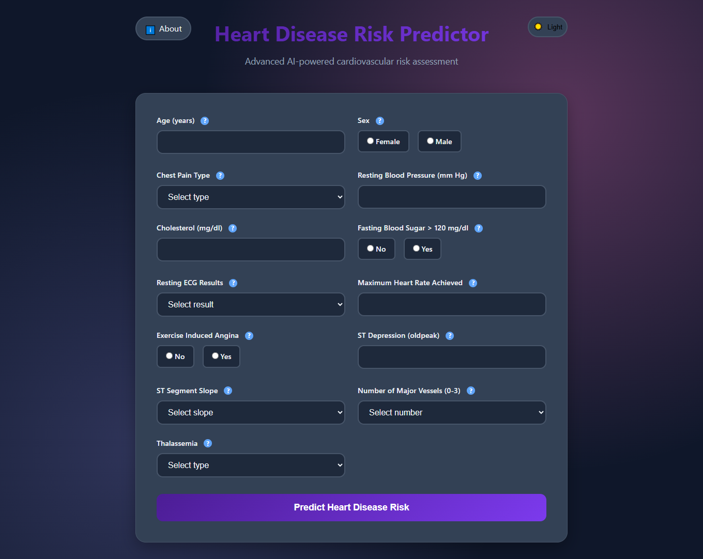

# 🫀 Heart Disease Risk Predictor

A web-based machine learning application that predicts a user's risk of heart disease based on medical inputs, using the UCI Heart Disease dataset. Built with Flask, scikit-learn, and modern web technologies.

 <!-- Replace or remove if not available -->

---

## 🔍 Project Overview

The **Heart Disease Risk Predictor** is designed to provide quick, AI-powered risk assessments based on key cardiovascular health indicators. It's built to demonstrate how machine learning can support healthcare in identifying potential risk early.

---

## 🚀 Features

- ✅ Predicts **High** or **Low Risk** using trained ML model
- ✅ Clean and responsive UI
- ✅ Input validation and tooltips for medical terms
- ✅ "About" page with project and tech details
- 🚧 Upcoming:
  - 📊 Data visualization (charts)
  - 📄 PDF report download
  - 🧠 Prediction explanation using SHAP/LIME
  - 🫁 Personalized lifestyle tips
  - 📘 Educational section on heart health

---

## ⚙️ Technologies Used

- **Frontend**: HTML5, CSS3, Bootstrap, JavaScript
- **Backend**: Flask, Python
- **ML**: scikit-learn, joblib
- **Visualization (Planned)**: Chart.js / Plotly
- **PDF (Planned)**: pdfkit / WeasyPrint
- **Explainability (Planned)**: SHAP / LIME

---

## 📊 Dataset

- Source: [UCI Heart Disease Dataset](https://archive.ics.uci.edu/ml/datasets/heart+Disease)
- Size: 303 records, 14 features
- Features include age, sex, chest pain type, cholesterol, resting blood pressure, fasting blood sugar, and more.

---

## 🛠️ How to Run Locally

1. **Clone the repository**:
    ```bash
    git clone https://github.com/yourusername/heart-disease-predictor.git
    cd heart-disease-predictor
    ```

2. **Install dependencies**:
    ```bash
    pip install -r requirements.txt
    ```

3. **Run the app**:
    ```bash
    python app.py
    ```

4. **Visit**: [http://127.0.0.1:5000](http://127.0.0.1:5000)

---

## 📁 Project Structure
```
heart-disease-predictor/
├── app.py
├── models/
│ ├── model.pkl
│ └── scaler.pkl
├── templates/
│ ├── index.html
│ └── about.html
├── static/
│ ├── indexstyles.css
│ └── aboutstyles.css
├── requirements.txt
└── README.md
```


---

## 🧠 Model Details

- Algorithm: Logistic Regression / (Your choice)
- Accuracy: ~95%
- Preprocessing: StandardScaler for feature normalization


---

## 🙌 Acknowledgements

- UCI Machine Learning Repository
- Flask and scikit-learn communities
- Font Awesome and Bootstrap for UI components

---

## 🌐 Connect with Me

- 💼 [LinkedIn](https://www.linkedin.com/in/aditya-dolas-992a44265/)
- 🧑‍💻 [GitHub](https://github.com/Adi1exe)
- 🌐 [Portfolio](https://adityadolas.netlify.app)
- 🐦 [X/Twitter](https://x.com/DolasAditya)

---